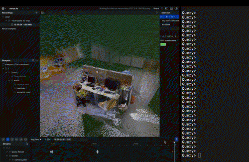
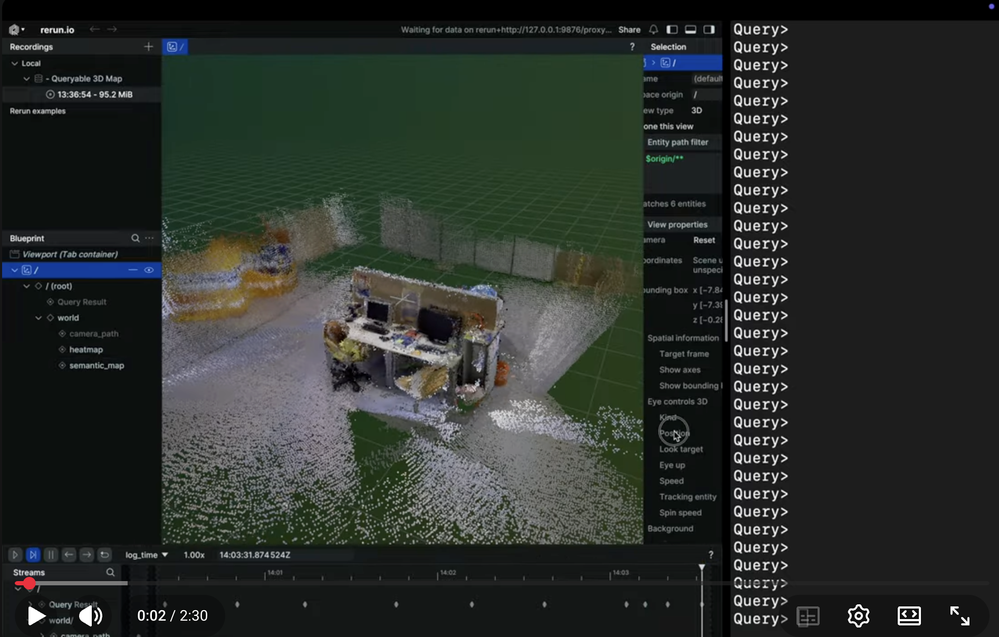
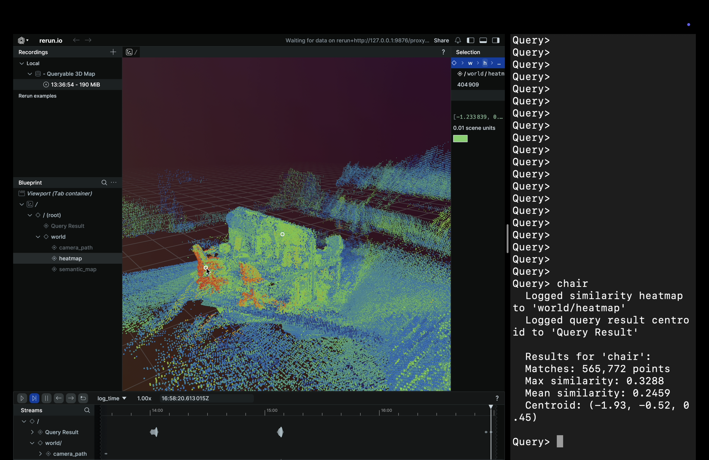
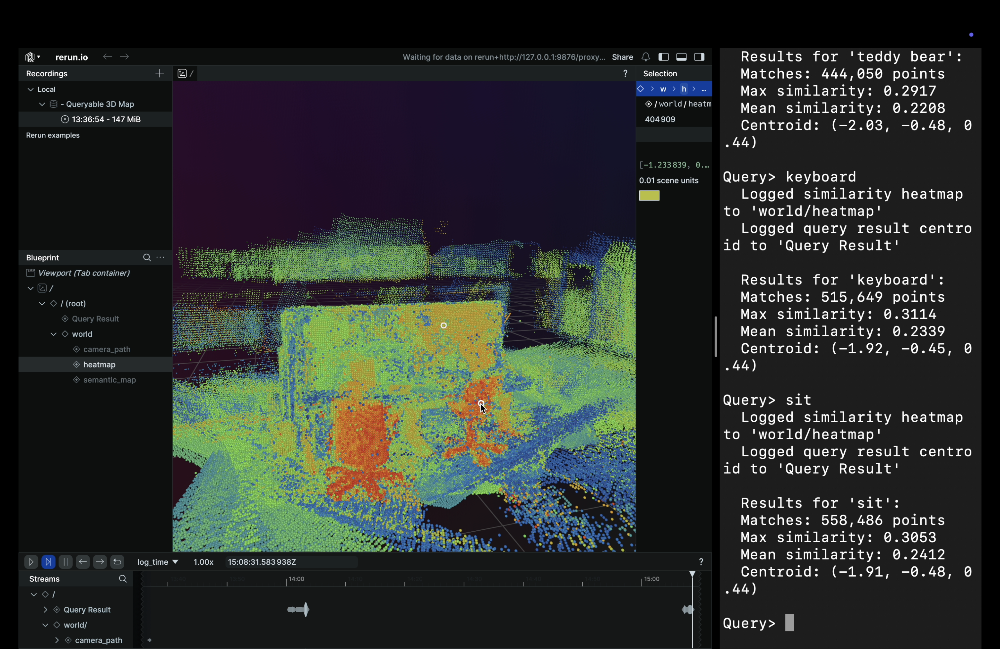
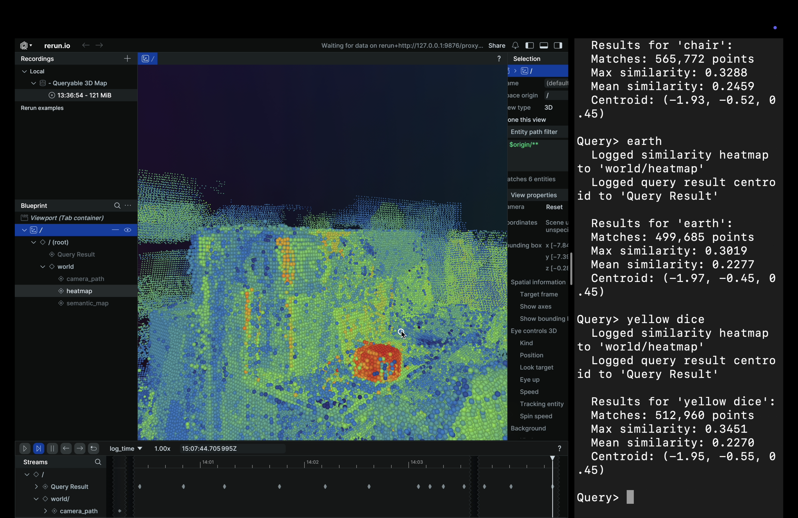
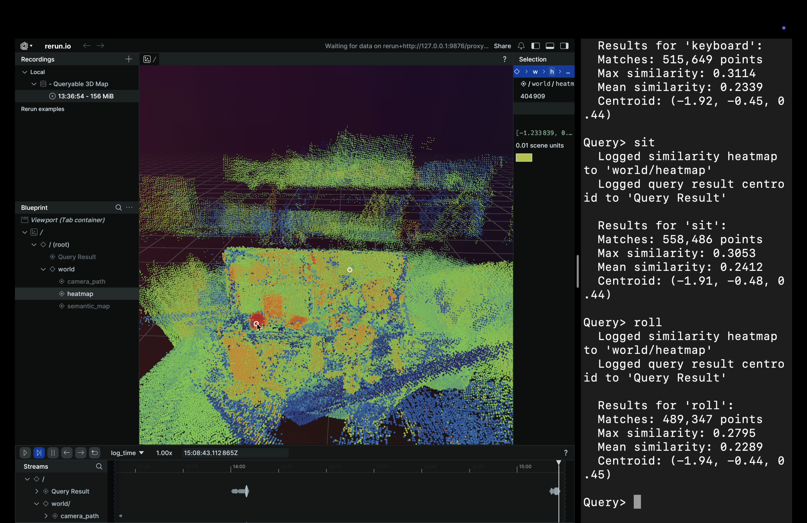

<h1 align="center">Zero-shot Open-Vocabulary Language Queryable 3D Semantic Map</h1>

__Inspired by the [**ConceptFusion**](https://arxiv.org/abs/2302.07241) and [**CLIP-Fields**](https://arxiv.org/abs/2210.05663) papers, a Python implementation of a zero shot open-vocabulary language queryable 3D semantic map creation from a video system.__

<!-- # th table of contents -->
<p align="center">
  <div align="center">
    
  </div>
</p>


<!-- # DIAGRAM IMAGE  -->

# Running the demo
## Environment setup
```python
pip install -r requirements.txt
```
## Dataset
Download the sequence __freiburg3_long_office_household__ from [TUM Dataset](https://cvg.cit.tum.de/data/datasets/rgbd-dataset/download) and specify the extracted location in the pipeline command

## Run the pipeline
```python
python3 pipeline.py --interactive --data <DATASET_ROOT>
```

## Demo Video

<!-- https://youtu.be/awIJe_8yHrY -->

[](https://youtu.be/awIJe_8yHrY)

<!-- <p align="center">
  <video src="demo.mov" controls width="640">
    <br>
    <a href="demo.mov">Download the demo video</a>
  </video>
</p> -->


<!-- # Dataset -->

# Usage
__Apart from querying the objects directly, equal semantic queries also provide the expected results. In ConceptFusion, audio and image queries were also available but they are not implemented in here.__
<table>
  <tr>
    <th>Object</th>
    <th>Semantic Equal</th>
  </tr>
  <tr>
    <td>Chair</td>
    <td>Sit</td>
  </tr>
  <tr>
    <td>Yellow Dice</td>
    <td>Roll</td>
  </tr>
</table>


# Roadmap
- [x] Full Pipeline over a known dataset with specified camera intrinsics
- [x] Compatible dataset creation from a video with specified camera intrinsics
- [ ] Compatible dataset creation from a video with unspecified camera intrinsics(maybe using [this AnyCam paper](https://arxiv.org/pdf/2503.23282))
- [ ] Full Pipeline working on a mobile app with no remote dependency by simply recording a video of an environment

# Acknowledgments

- [**ConceptFusion**](https://arxiv.org/abs/2302.07241)
- [**CLIP-Fields**](https://arxiv.org/abs/2210.05663)
- [**LSeg**](https://arxiv.org/pdf/2201.03546)
- [**FastSAM**](https://github.com/CASIA-LMC-Lab/FastSAM)
- [**CLIP**](https://arxiv.org/pdf/2103.00020)
- [**MobileCLIP**](https://github.com/apple/ml-mobileclip)
- [**rerun.io**](https://rerun.io/)

